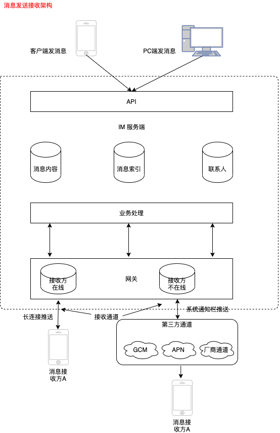
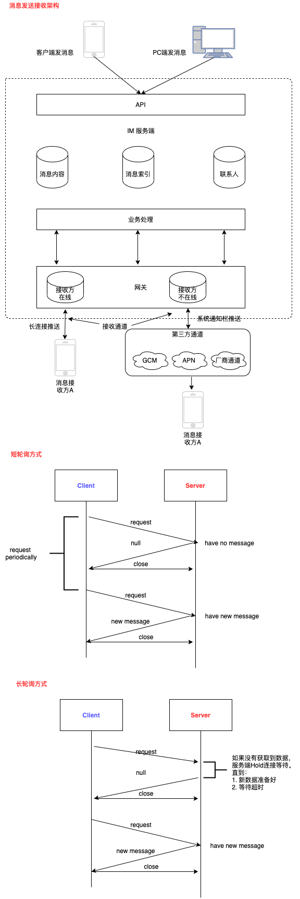
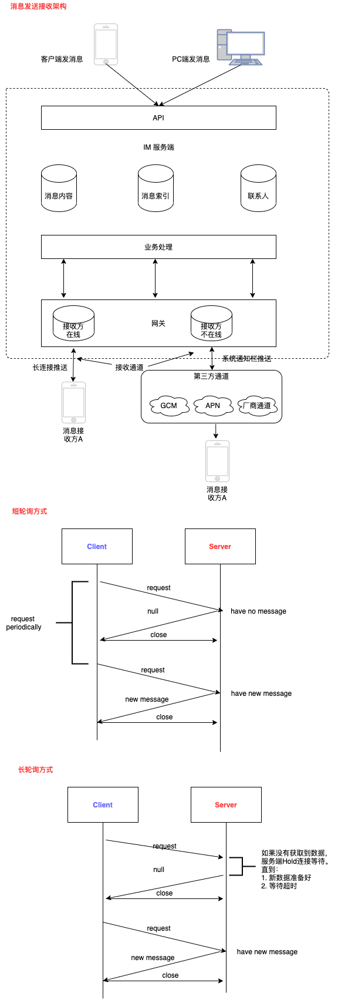
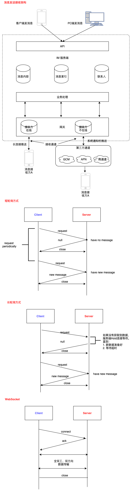
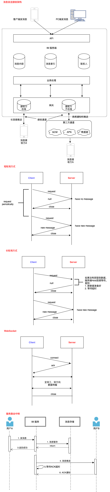
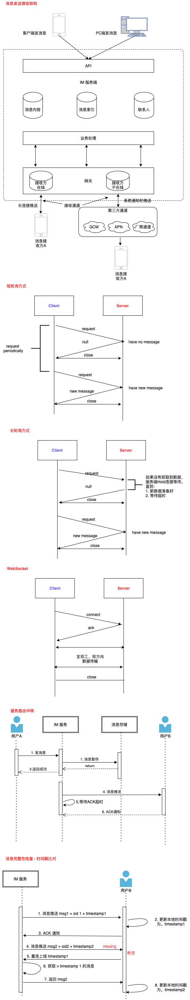

# Instant Messaging, IM 即时消息


### IM应用场景&业务功能
* QQ/Wechat 聊天类场景: 即时通讯
* 豆瓣/知乎 社区类场景: 用户点对点聊天
* YY/抖音 直播类场景: 主播互动、实时弹幕
* 小米/京东智能家居类IOT场景: 实时监控、远程控制
* 畅游游戏类场景: 多人互动
* 滴滴/Uber交通类场景: 位置共享
* 新东方/网易云课堂 教学类场景: 在线白板

### IM 架构体系
> IM 架构设计在大规模分布式、高并发、一致性架构设计等方面有很多成熟的解决方案。涵盖了网络、数据库、性能、安全、分布式、架构设计、消息队列


### 聊天系统
```
# 普通视角
    用户账号: 唯一标识
    账号关系: 关系链
    联系人列表:
    消息:
    聊天会话:

# 开发视角
    客户端:
    接入服务:
        连接保持,
        协议解析，
        Session维护: session的作用是标识“那个用户在那个TCP连接”用于后续的消息推送能够知道如何找到接入人对应的连接来发送
        消息推送: 通过网络连接把最终的消息从服务器传输送达用户的设备上
    业务处理服务:
        存储处理、
        消息同步、
        离线buffer、
        未阅读数
        更新最近联系人
    存储服务:
        消息:
        账号信息:
        设置:
        附件:
    外部接口服务:
        通过公共连接服务进行操作系统级"消息推送"
        APNs (Apple Push Notification service) 苹果手机自带的APNs服务
        GCM (Google Cloud Messaging) 安卓手机内置服务

接入服务和业务处理拆分：
    1. 接入服务作为消息首发的出入口，必须是一个高可用的服务，保持足够的稳定性
    2. 接入服务和业务处理服务进行拆分有助于提升业务开发效率，降低业务开发门槛

即时消息系统四个重要特性:
1. 实时性 保证消息实时触达是互动场景的必备能力
2. 可靠性 [不丢消息、消息不重复]
3. 一致性 多用户、多终端的一致性体验能大幅提升IM系统的使用体验
4. 安全性 [数据传输安全、数据存储安全、数据内容安全]

# 对原有业务系统增加实时消息模块
1. 消息存储:
    对消息进行服务端存储
2. 消息索引和消息内容:
    库表设计上分析
        1. 索引表中收发双方各自有自己的索引记录, 一条是消息发送方的发件箱索引表[user_id, 内容表ID]，另一条是消息接收方的收件箱索引表[], 消息内容表[消息ID，消息内容，消息类型，消息产生时间]
3. 联系人列表:
    联系人列表只更新存储收发双方的最新一条消息，不存储两人所有的历史消息
    消息索引表的使用场景一般用于查询收发双方的历史聊天记录，是聊天会话纬度，联系人表的使用场景用于查询某一个人最近的所有联系人，是用户全局纬度
```

内容表
> 存储消息纬度的一些基本信息,
| 消息ID | 消息内容 | 消息类型 | 消息产生时间 |
|:-------|:---------|:---------|:-------------|
| 1001   | 你好     | 文本消息 | 2020-07-15 12:00:00|

索引表
> 收发双方各自有一条自己的索引记录
| 索引用户UID | 索引消息另一方UID | 是发件箱还是收件箱 | 消息ID |
|:------------|:------------------|:-------------------|:-------|
| 张三UID     | 李四UID           | 0                  | 1001   |
| 李四UID     | 张三UID           | 1                  | 1001   |

联系人表
| 索引用户UID | 索引消息的另一方UID | 消息ID |
|:------------|:--------------------|:-------|
| 张三UID     | 李四UID             | 1001   |
| 李四UID     | 张三UID             | 1001   |

* 消息发送通道
    > 发送方通过发送通道把消息从本地发送到IM服务端
    ```
    1. IM服务端提供HTTP协议API接口，客户端需要发送消息，调用这个接口把消息发给IM服务端
    2. 客户端和IM服务端维护一个TCP长连接，客户端有消息发送时，会以私有协议封装这条要发送的消息，然后通过TCP长连接把消息发给IM服务端
    ```

* 消息接受通道
    > IM服务端通过通道把消息投递给接收方
    ```
    IM服务端的网关服务和消息接收方设备之间维护一条TCP长连接(Websocket长连接)，借助TCP的全双工能力，能够同时接收与发送数据的能力
    辅助通道是厂商维护，只要手机网络可通，可以在App没有打开的情况下，也能把消息实施推送下去
    ```


* 消息未读数提醒
```
1. 用户纬度总未读数的计数
2. 会话纬度未读的计数
```

### 轮询与长连接
* 1. 短轮询场景
> 短轮询模式中，服务器接到请求后，如果有新消息就会将新消息返回给客户端，如果没有新消息就返回空列表，并关闭连接
> 高频请求对服务端资源的压力比较大，大量服务器用于扛高频轮询QPS(每秒查询率)


* 2. 长轮询场景
```
长轮询和短轮询相比, 短轮询模式下，服务端不管本轮有没有新消息产生，都会马上响应并返回，而长轮询模式当本次请求没有获取到新消息时，并不会马上结束返回，而是会在服务端 hang(悬挂) 等待一段时间，如果在等待的这段时间内有新消息产生，就能马上响应返回.

长轮询能大幅降低短轮询模式中客户端高频无用的轮询导致的网络开销和功耗开销，降低服务端处理请求的QPS
1. 服务端悬挂hang住请求，只是降低入口请求的QPS，并没有减少对后端资源轮询的压力，加入有1000个请求的等待消息，可能意味着有1000线程在不断轮询消息存储资源
2. 长轮询在超时时间内没有获取到消息时，会结束返回，因此仍然没有完全解决客户端“无效”请求
```


> 短轮询和长轮询是基于HTTP协议实现，由于HTTP是一个无状态协议，同一客户端的多次请求对于服务端来说并没有关系，也不会去记录客户端相关的连接信息

3. Websocket 服务端推送
> WebSocket服务端推送计数，基于单个TCP连接的全双工通信WebSocket

```
1. 支持服务端推送的双向通信，大幅降低服务端轮询压力
2. 数据交互的控制开销底，降低双方通信的网络开销
3. Web原生支持、实现简单

TCP 长连接通信协议：在用户上线连接时，在服务端维护好连接到服务器的用户设备和具体TCP连接的映射关系，通过这种方式客户端能随时找到服务端，服务端也能通过这种映射关系随时找到对应在线的用户的客户端

MQTT: 基于代理的“发布/订阅”模式
```

### ACK机制，消息可靠投递
消息的可靠投递：消息发送接收过程中，能够做到不丢消息、消息不重复

"服务端路由中转":

```
1. 通过客户端A的超时重发和IM服务器的去重机制
2. 参考TCP协议的ACK机制，实现一套业务层的ACK协议
3. 发送端针对同一条重试消息有唯一的ID，便于服务端去重使用
```

* ACK (Acknowledge) 机制
> ACK + 超时重传+去重
```
1. 大部分场景和实际实现中，通过业务的ACK确认和重传机制，能解决大部分推送过程中消息丢失的情况
2. 通过客户端的去重机制，屏蔽掉重传过程中可能导致消息重复的问题，从而不影响用户体验
3. 针对重传消息不可达的特殊场景，可以通过“兜底”的完整性检查机制来及时发现消息丢失的情况并进行补推修复，消息完整性检查可以通过时间戳比对，或者全局自增序列等方式实现
```


> 由于时间戳存在多机器时钟不同步的问题，可能存在偏差，导致数据获取上不够精确，在实际的实现上，可以使用全局的自增序列作为版本号来代替


### 消息序号生成器
> 消息收发一致性(消息的时序一致性)
```
"全局序号生成器":
    1. Redis 原子自增命令INCR: -- 单点可能容易出现性能瓶颈
    2. DB 自增ID
    3. Twitter snowflake 算法
    4. 时间相关的分布式序号生成服务

从业务层面：可以针对每个群有独立的“ID-生成器”,能通过哈希规则把压力分散到多个主库实力, 降低多群公用一个“ID生成器”的并发压力

消息服务端包内整流:
    packageID: 消息包ID
    seqID: 包内消息

消息客户端本地整流:
```

### httpDNS & TLS:
```
消息传输安全性:
    安全风险:
        DNS劫持：导致发往IM服务器的请求被拦截到其他服务器，导致内容泄漏或失效; 明文传输的消息内容被中间设备截取后篡改内容，法往IM服务器引起业务错误
    1. 访问入口安全:
        1. LocalDNS是部分运营商为了降低跨网流量，缓存部分域名的指向内容，把域名强行指向自己的内容缓存服务器的IP地址
            > HTTPDNS 通过HTTP协议(而不是UDP的DNS标准协议) 直接和DNS服务器交互，能有效防止域名被运营商劫持的问题
        2. 运营商可能会修改DNS的TTL(Time-To-Live, DNS缓存时间),导致DNS的变更生效延迟，影响服务可用性


    2. 传输链路安全:
        TLS传输层加密协议:
            私有协议:
            TLS协议对业务数据进行保护，把“对称加密算法”、“非对称加密算法”、“密钥交换算法”、“消息认证码算法”、“数字签名证书”、“CA认证” 进行结合，有效地解决消息传输过程中的截获、篡改、伪造问题.

消息存储安全性:
    针对账号密码存储安全采用：高强度单向散列算法[SHA, MD5算法], 每个账号独享"Salt" 结合密码原文进行加密存储

消息内容安全性:
    消息内容采用“端到端加密” (E2EE),中间任何链路环节都不对消息进行解密
    > 端到端加密的通信双方各自生成密钥并进行公钥的交换，私钥各自保存在本地不给到IM服务器，发送方的消息使用接收方的公钥进行加密，因此即使IM服务器端拿到加密信息，由于没有接收方的私钥，也无法解密消息
```


## FAQ
* 1. 消息一定需要在服务端的存储服务存储吗？
* 2. 消息存储中，内容表和索引表分库处理，应该按什么字段来哈希？索引表可以和内容表合并成一个表吗
* 3. 能从索引表里获取到最近联系人所需要的信息，为什么还需要单独的联系人表呢？
* 4. TCP长连接的方式是怎么实现？当有消息需要发送给某个用户时，能够准确找到这个用户的对应的网络连接?
* 5. 具有TCP协议本身的ACK机制为什么还需要业务层的ACK机制?
