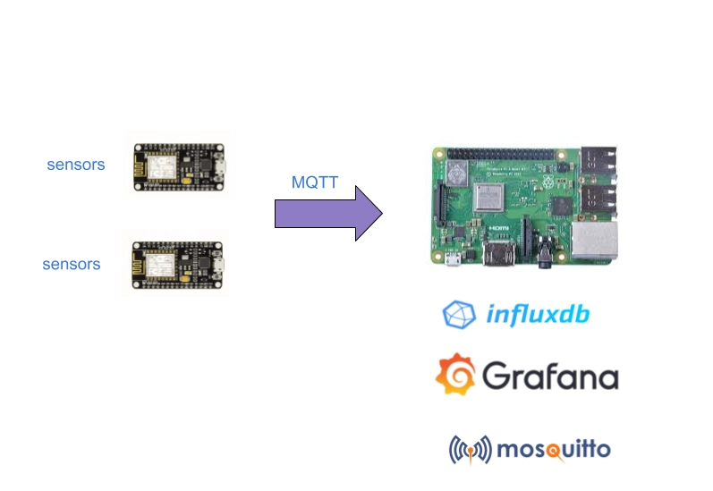

# Raspberry Pi IoT: Sensors, InfluxDB, MQTT and Grafana
> build a system that reads data from sensors, send data to mosquitto (aka the MQTT broker), InfluxDB reads from Mosquitto and stores these readings. Then Grafana connects to InfluxDB and produces charts that visualize the data acquired by sensors. All the systems exchange data using MQTT.

[raspberry-pi-iot-sensors-influxdb-mqtt-grafana](https://www.survivingwithandroid.com/raspberry-pi-iot-sensors-influxdb-mqtt-grafana/)



## Requirements
* Mosquitto: acts as the MQTT broker accepting data coming from sensors (other pi manages sensors and acts as a publisher)
* Telegraf subscribes to the MQTT topic, where sensors publish data. Telegraf stores this information into InfluxDB.
* InfluxDB: a time-series database
* Grafana: reads the data in InfluxDB and manages the dashboard to visualize such information

### Installing and configuring Mosquitto on Raspberry Pi using Docker
```
# install Mosquitto on Raspberry Pi
❯ sudo docker pull eclipse-mosquitto:1.6.12
1.6.12: Pulling from library/eclipse-mosquitto
801bfaa63ef2: Pull complete
4af86956ebd4: Pull complete
e8d566310b58: Pull complete
Digest: sha256:7554e4f05739e0ce57baf331930d4e16d14f25c1ff6fb5309618ac556560e49a
Status: Downloaded newer image for eclipse-mosquitto:1.6.12
docker.io/library/eclipse-mosquitto:1.6.12

# start MQTT broker
❯ sudo docker run -it -p 1883:1883 -p 9001:9001 eclipse-mosquitto:1.6.12
1626357276: mosquitto version 1.6.12 starting
1626357276: Config loaded from /mosquitto/config/mosquitto.conf.
1626357276: Opening ipv4 listen socket on port 1883.
1626357276: Opening ipv6 listen socket on port 1883.
1626357276: mosquitto version 1.6.12 running

# Installing and configuring InfluxDB (is a time-series database)
❯ sudo docker pull influxdb
[sudo] password for chyi:
Using default tag: latest
latest: Pulling from library/influxdb
0bc3020d05f1: Pull complete
a110e5871660: Pull complete
83d3c0fa203a: Pull complete
dbe08b7c7bd3: Pull complete
77a752c953de: Pull complete
77fee0b45346: Pull complete
c5d853369c0c: Pull complete
03fd4c49d9b9: Pull complete
1f535b15085d: Pull complete
Digest: sha256:7d6dcce155a3a09d2c29e0d03c8f26514081b730938aab560df3d40044a9a9f3
Status: Downloaded newer image for influxdb:latest
docker.io/library/influxdb:latest

# start InfluxDB
$ sudo docker run -d -p 8086:8086 -v influxdb:/var/lib/influxdb --name influxdb influxdb

❯ docker ps
CONTAINER ID   IMAGE               COMMAND                  CREATED          STATUS         PORTS                                                                                  NAMES
4d31d5a37e45   influxdb            "/entrypoint.sh infl…"   10 seconds ago   Up 8 seconds   0.0.0.0:8086->8086/tcp, :::8086->8086/tcp                                              influxdb
36a5826678cc   eclipse-mosquitto   "/docker-entrypoint.…"   8 minutes ago    Up 8 minutes   0.0.0.0:1883->1883/tcp, :::1883->1883/tcp, 0.0.0.0:9001->9001/tcp, :::9001->9001/tcp

# create an InfluxDB database and user
$ docker exec -it influxdb influx setup

Config default has been stored in /etc/influxdb2/influx-configs.
User		Organization	Bucket
telegraf	chyidl.com	    sensors

# Installing and confuguring Telegraf
> Telegraf is the component that connects to the MQTT broker subscribing to the channel where sensors data is published and stores this information into the InfluxDB.
❯ sudo docker pull telegraf
Using default tag: latest
latest: Pulling from library/telegraf
0bc3020d05f1: Already exists
a110e5871660: Already exists
83d3c0fa203a: Already exists
bc0127a0f443: Pull complete
17198a0e45f3: Pull complete
9a17aed789fc: Pull complete
8e2d8d321f52: Pull complete
Digest: sha256:d4227f7b427816d4c74fb7043dfb80c7de2d7d9cfe2769f59e082cec7b40c6b4
Status: Downloaded newer image for telegraf:latest
docker.io/library/telegraf:latest

# creating a default configuration 
❯ sudo docker run --rm telegraf telegraf config > telegraf.conf

```

