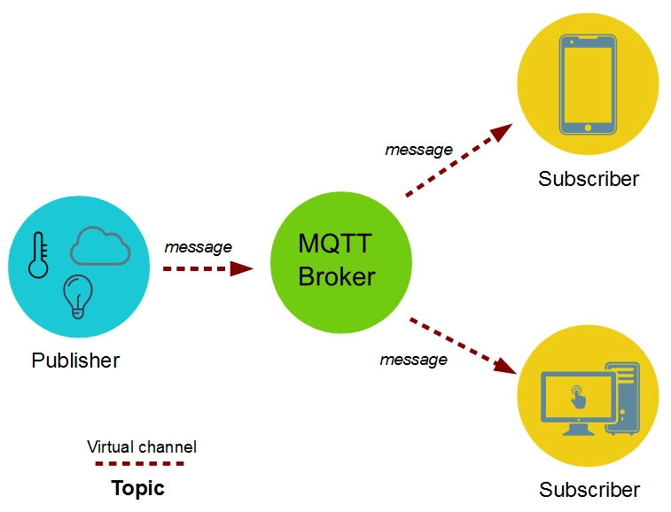

# MQTT Protocol
> MQTT protocol is a Machine to Machine (M2M) protocol widely used in IoT (Internet of things).


## MQTT Protocol Tenchnical description
> MQTT uses the publish-subscribe paradigm in contrast to HTTP based on the request/response paradigm. MQTT protocol uses TCP stack as a transmission substrate.

## The role of the MQTT Broker and MQTT Client
> MQTT is an asynchronous protocol, which means that it does not block the client while it waits for the message.
    * MQTT broker: dispatching message to the MQTT clients(subscribers). In other words, the MQTT broker receives messages from the publisher and dispatches these messages to the subcribers.
    * MQTT topic: A topic is a virtual channel that connects a publisher to its subscribers.



## Mosquitto
> An open source MQTT broker (aka MQTT server)
```
# add the repository mosquitto
$ wget http://repo.mosquitto.org/debian/mosquitto-repo.gpg.key

# import the key
$ sudo apt-get add mosquitto-repo.gpg.key

# install mosquitto on Raspiberry Pi
$ sudo apt-get install mosquitto

# install the publisher and the subscriber
$ sudo apt-get install mosquitto-clients

# How to send an MQTT Message

```
