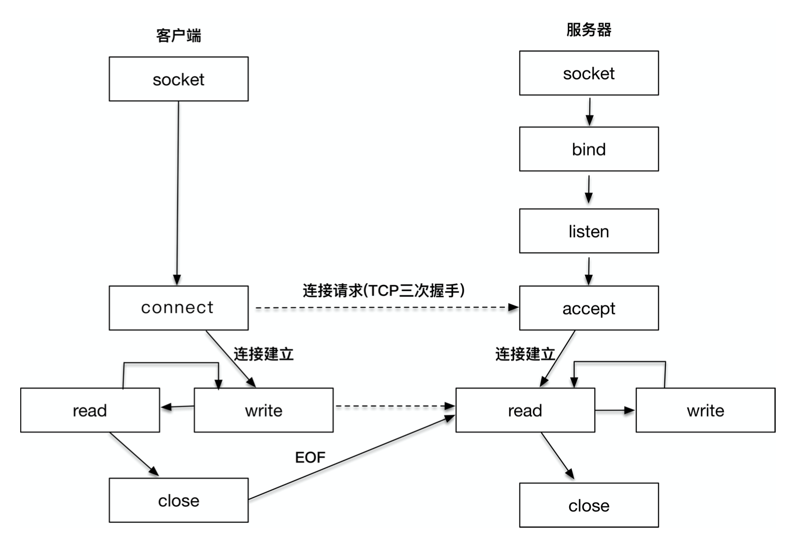

# Computer network programming

> Computer network programming involves writing computer programs that enable processes to communicate with each other across a computer network.

* Connection-oriented (面向连接通信)
    * TCP (Transmission Control Protocol)
    * SPX (Sequenced Packet Exchanges)

* connectionless communications (无连接通信)
    * UDP (User Datagram Protocol)
    * raw IP
    * IPX (Internetwork Packet Exchange)

| OSI/ISO Layer | Protocol | API |
|:--------------|:---------|:----|
| L1 (Physical) | Bluetooth, Eithernet, USB, CAN | |
| L2 (Data Link)| MAC| |
| L3 (network)  | IP | Raw socket|
| L4 (Transport)|TCP,UDP,SCTP| Berkeley Sockets|
| L5 (session)| TLS | OpenSSL|
| L6 (Presentation)| | |
| L7 (application) | HTTP | Various|

* Layer 1: Physical Layer
> It cinverts the digital bits into electrical, radio, or optical signals.

* Layer 2: Data Link Layer
> The data link layer provides node-to-node data transfer -- a link

* Layer 3: Network Layer
>

* Layer 4: Transport Layer
>

| TCP/IP  | Protocol | API |
|:--------------|:---------|:----|
| L1 (Link) | Bluetooth, Eithernet, USB, CAN | |
| L2 (Internet)| IP| |
| L3 (Transport)  | TCP, UDP | Raw socket|
| L4 (Application)|| Berkeley Sockets|

* Link Layer:

* Internet Layer:

* Transport Layer:

* Application Layer:

* client-server model: 客户端-服务端网络编程模型
```
当一个客户端发起连接请求时，客户端的端口是由操作系统内核临时分配的,
套接字对: client_addr: client_port, server_addr: server_port
```

* 保留网段
| RFC1918 name | IP address range | Number of addresses | Largest CIDR block (subnet mask) | Host ID size | Mask bits | Classful description |
|:-------------|:-----------------|:--------------------|:---------------------------------|:-------------|:----------|:---------------------|
| 24-bit block| 10.0.0.0 - 10.255.255.255| 16777216| 10.0.0.0/8 (255.0.0.0)|24 bits| 8bits| single class A network|
| 20-bit block | 172.16.0.0 - 172.31.255.255| 1048576|172.16.0.0/12(255.240.0.0) | 20 bits|12 bits| 16 contiguous class B networks|
| 16-bit block | 192.168.0.0 - 192.168.255.255| 65536|192.168.0.0/16(255.255.0.0)|16 bits| 16 bits | 256 contiguous class C networks|

```
1. network: IP range 共同部分
2. host: 主机
3. netmask: 子网淹码
```

* Domain Name System (DNS)
> 记录网站和IP对应关系, 全球域名按照从大到小的结构，形成一棵树状结构，实际访问一个域名时，是从最底层开始写起

* TCP/UDP
```
TCP(Transmission Control Protocol), 字节流套接字 (Strem Socket) -- SOCK_STREAM
    - TCP 通过连接管理、拥塞控制、数据流、窗口管理、超时、重传等一系列设计，提供高质量的端到端的通信方式

UDP, 数据报套接字 (Datagram Socket) -- SOCK_DGRAM
```

```
socket: 用来建立连接，传输数据的唯一途径.
socket 成为网络互联互通的标准.

套接字的地址格式:
    sa_family: 地址族 AF_ 表示Address Family; PF_ 表示Protocol Family
        AF_LOCAL: 本地地址，Unix套接字，一般用于本地socket通信，可以写成AF_UNIX, AF_FILE
        AF_INET: 因特网使用的IPv4地址
        AF_INET6: 因特网使用的IPv6地址

        AF_xxx 初始化socket地址，PF_xxx初始化socket
    sa_data[14]: 具体的地址值

TCP 三次握手:

客户端/服务端模型:
```
