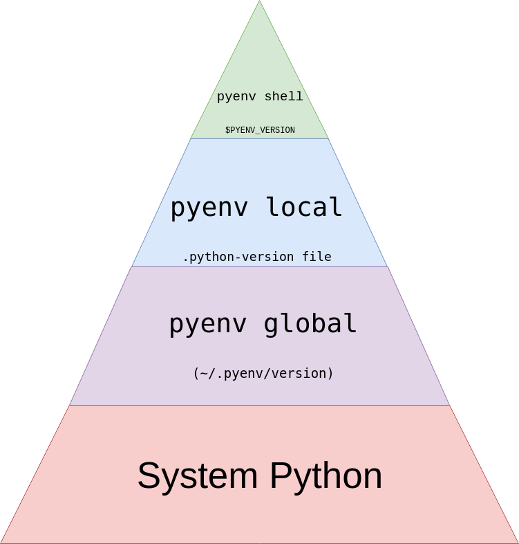

# Python Tips

[Python Tips](https://book.pythontips.com/en/latest/)


Table of Contents
-----------------

* [*args and **kwargs](#args_kwargs)
* [Debugging](#debugging)
* [Generators](#generators)
* [Map, Filter and Reduce](#map_filter_reduce)
* [set Data Structure](#set)
* [Ternary Operators](#ternary)
* [Decorators](#decorators)
* [Global & Return](#global_return)
* [Mutation](#mutation)
* [__slots__ Magic](#slots)
* [Virtual Environment](#virtual_environment)
* [Collections](#collections)
* [Enumerate](#enumerate)
* [Zip and unzip](#zip_unzip)
* [Object introspection](#object_instrospection)
* [Comprehensions](#comprehensions)
* [Exceptions](#exceptions)
* [Classes](#classes)
* [Lambdas](#lambdas)
* [One-liners](#one_liners)
* [for/else](#for_else)
* [Python C extensions](#python_c_extensions)
* [open Function](#open_function)
* [Targeting Python 2+3](#targeting_python_2_3)
* [Coroutines](#coroutines)
* [Function caching](#function_caching)
* [Context Managers](#context_managers)
* [pyenv + Poetry](#pyenv_poetry)


args_kwargs
-----------
```

```

pyenv_poetry
------------
* pyenv
> is a python installation manager.

```
# See all available python installations
$ pyenv install --list

# Install some python versions
$ pyenv install 3.9.6

# See all python installations that you have installed.
➜ pyenv versions
  system
* 3.8.6 (set by /home/chyi/.python-version)
  3.8.6/envs/demo-prj
  3.8.6/envs/dobby-api-prj
  3.8.6/envs/local-prj
  3.8.6/envs/notebook-prj
  3.9.4
  3.9.6
  demo-prj
  dobby-api-prj
  local-prj
  notebook-prj

# Set the default/global from one of the Python versions
$ ➜ pyenv global 3.9.6

# In the current directory, set the python version. This creates the file .python-version.
$ pyenv local 3.8.6

# To see which python is currently being used.
➜ pyenv version
3.9.6 (set by /home/chyi/.pyenv/version)
```

* poetry
> is a packaging and dependency manager. It resolves library dependencies, and can build and publish your project to be distributed on your private pypi repository.
```
pyproject.toml: Define the requirements, the dev-requirements and project metadata in this file
poetry.lock:

# Add poetry to your shell
export PATH="$HOME/.poetry/bin:$PATH"

# For tab completion in your shell, see the documentation
$ poetry help completions

# Configure poetry to create virtual environments inside the project's root directory
$ poetry config virtualenvs.in-project true

# Create a new project, and directory
$ poetry new hugos-ds-poetry-demo

# Specify some libraries
$ cd hugos-ds-poetry-demo
$ poetry add pandas

# Specify some dev libraries
$ poetry add --dev black flake8
```
