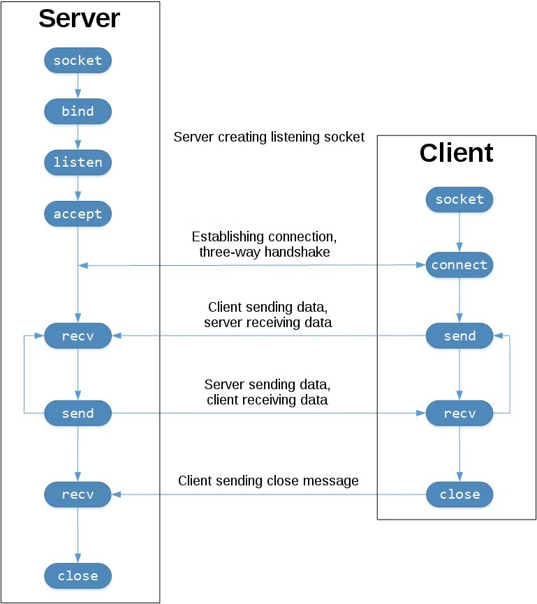

# Socket Programming in Python


### (IPC) Inter-process communication
> allow the processes to manage shared data.

| Method | Short Description | Provided by (operating systems or other environments) |
|:-------|:------------------|:------------------------------------------------------|
| File| A record stored on disk, or a record synthesized on demand by a file server, which can be accessed by miltiple processes.| Most operating systems|
| Communications file| A unique form of IPC in the late-1960s that most closely resembles Plan 9's 9P protocol| Dartmouth Time-Sharing System|
| Signal; also Asynchronous System Trap| A system message sent from one process to another, not usually used to trasfer data but instead used to remotely command the partnered process.| Most operating systems|
| Socket| Data sent over a network insterface, either to a different process on the same computer or to another computer on the network. Stream-oriented (TCP; data written through a socket requires formatting to preserve message boundaries) or more rarely message-oriented(UDP, SCTP). | Most operating systems|
|Unix domain socket | Similar to an internet socket, but all communication occurs within the kernel. Domain sockets use the file system as their address space. Processes reference a domain socket as an inode, and multiple processes can communicate with one socket | All POSIX operating systems and Windows 10|
|Message queue|A data stream similar to a socket, but which usually preserves message boundaries. Typically implemented by the operating system, they allow multiple process to read and write to the message queue without being directly connected to each other. | Most operating systems |
|Anonymouse pipe|A unidirectional data channel using standard input and output. Data written to the write-end of the pipe is buffered by the operating system until it is read from teh read-end of the pipe. Two-way communicated between processes can be achieved by using two pipes in opposite "directions"| All POSIX systems, Windows|
| Named pipe| A pipe that is treated like a file. Instead of using standard input and output as with an anonymous pipe, processes write to and read from a named pipe, as if it were a regular file.| All POSIX systems, Windows,|
| Shared memory | Multiple processes are given access to the same block of memory, which creates a shared buffer for the processes to communicate with each other| All POSIX systems, Windows|
| Message passing| Allows multiple programs to communicate using message queues and/or non-OS managed channels. Commonly used in concurrency models.| Used in RPC|
| Memory-mapped file| A file mapped to RAM and can be modified by changing memory addresses directly insteaded of outputting to a stream. This shares the same benefits as a standard file.| All POSIX systems, Windows|

```
# The primary socket API functions and methods in this module are:
    socket()
    bind()
    listen()
    accept()
    connect()
        three-way handshake: it ensures that each side of the connection is reachable in the network
    connect_ex()
    send()
    send_all()
        continues to send data from bytes until either all data has been sent or an error occurs.
    recv()
        recv(1024): bufsize argument of 1024 used above is the maximum amount of data to be received at once.
    close()

# TCP (Transmission Control Protocol):
    Is reliable: packets dropped in the network are detected and retransmitted by the sender
    Has in-order data delivery: data is read by your application in the order it was written by the sender.

# UDP (User Datagram Protocol)
```


* Viewing Socket State
```
To see the current state of socket
➜ netstat -an
Active Internet connections (servers and established)
Proto Recv-Q Send-Q Local Address           Foreign Address         State
tcp4       0      0 127.0.0.1.65432         *.*                     LISTEN

➜ lsof -i -n | grep 65432
COMMAND     PID   USER   FD    TYPE   DEVICE                SIZE/OFF                NODE NAME
Python    33627 yogo    3u     IPv4  0x558cb2b475a99ad         0t0                  TCP localhost:65432 (LISTEN)
```

* lookback
```
loopback interface (IPv4 address 127.0.0.1 or IPv6 address ::1)
```

* Handling Multiple Connections
```
select():
    allow to check for I/O completion on more than one socket.
    call select() to see which sockets have I/O ready for reading and/or writing.

asyncio:
    use single-threaded cooperative multitasking and an event loop to manage tasks.
```

* Application Client and Server
```
# determine the byte order machine
➜ python3 -c 'import sys; print(repr(sys.byteorder))'
'little'

# Application Protocol Header
  Variable-length text
  Unicode with the encoding UTF-8
  A Python dictionary serialized using JSON
```

* Communication Breakdown
